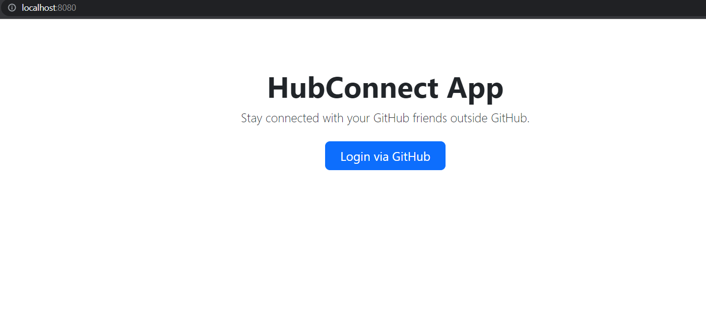
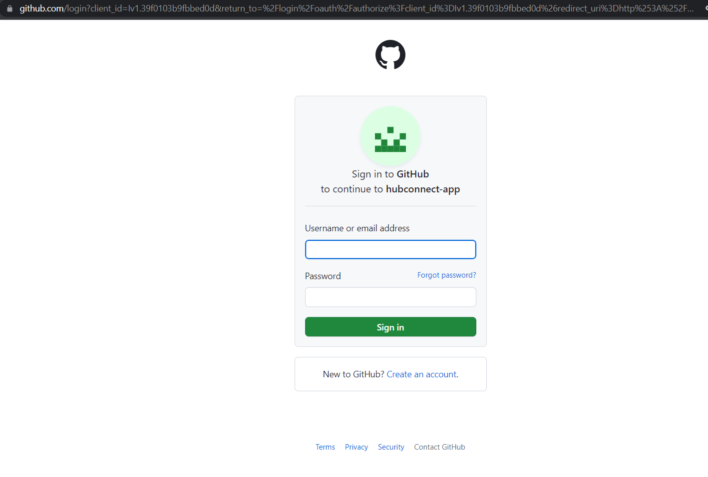
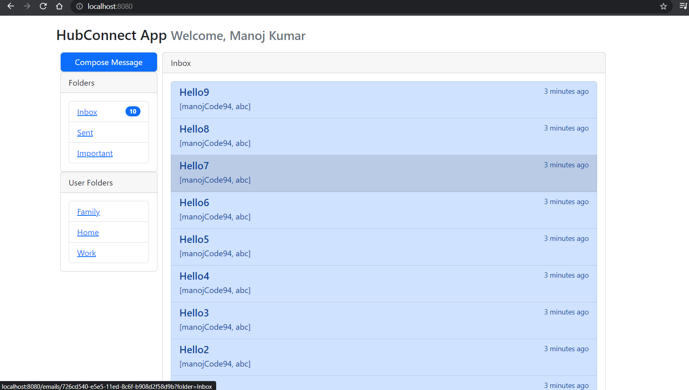
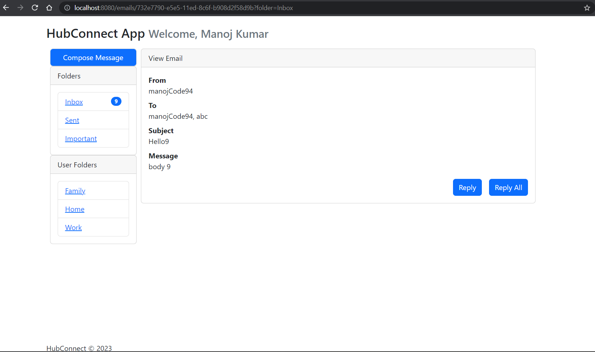
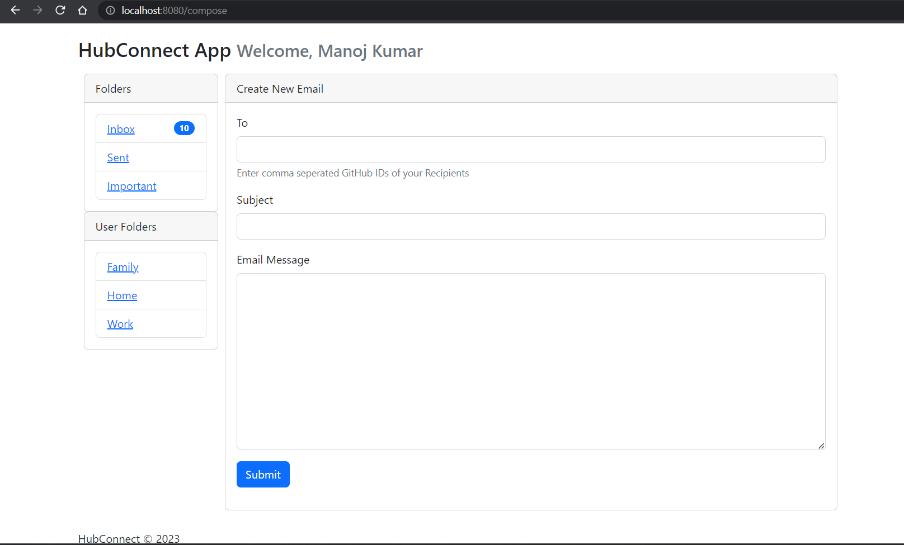
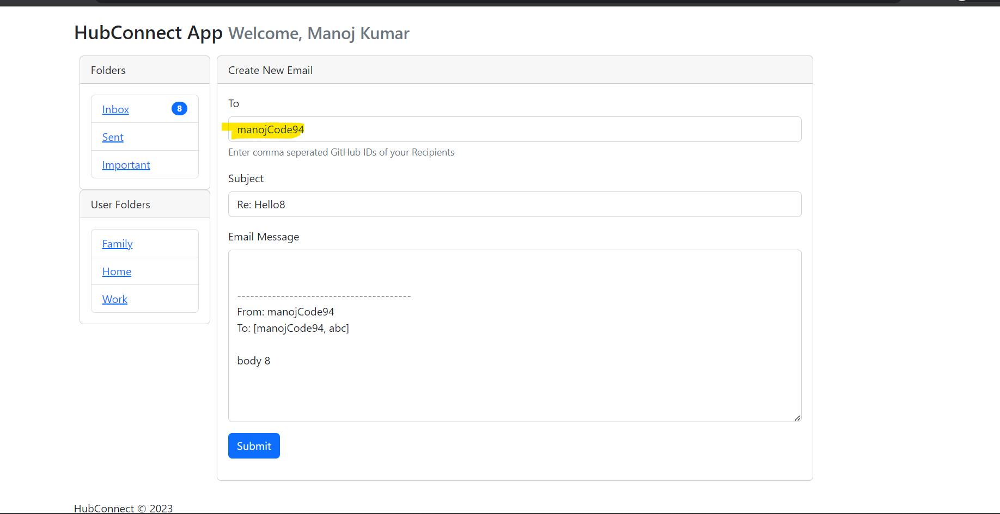
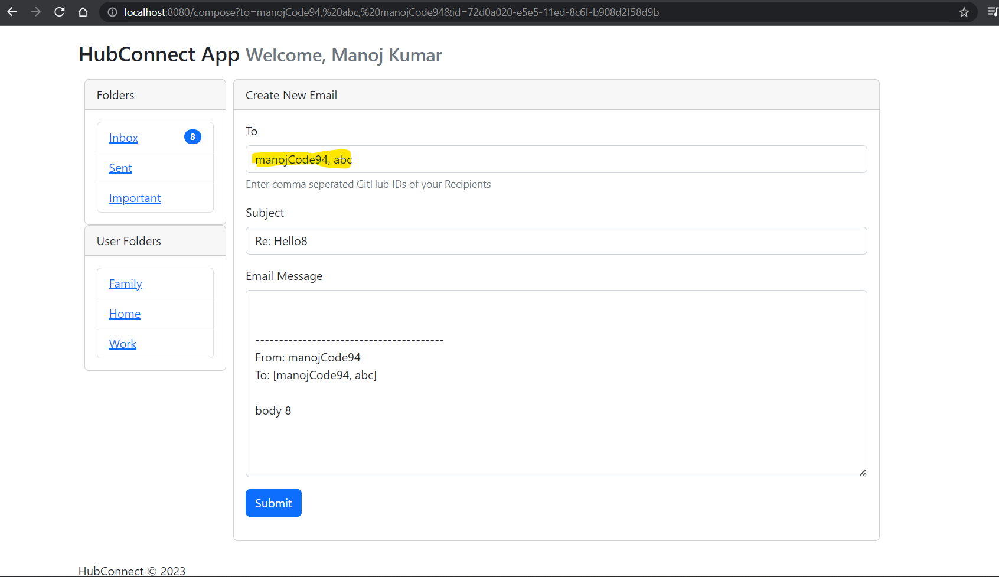

<h1>HubConnect APP</h1>

Stay connected with GitHub friends outside GitHub

<h2>Tech Stack</h2>
<ul>
  <li>Java</li>
  <li>Spring Boot</li>
  <li>Spring Security OAuth2 using GitHub</li>
  <li>Cassandra on Datastax cloud</li>
</ul>

Cloud hosted <strong>Cassandra database</strong> link: <a href="https://www.datastax.com/" target="_blank">DataStax</a>

<h2>Features</h2>
<ul>
  <li>Users can exchange messages between their GitHub friends</li>
  <li>Compose message, reply, and reply all</li>
  <li>Maintains message threads</li>
  <li>Maintains message counter in a folder as messages arrive</li>
  <li>User can track the message had been read or not</li>
</ul>
<h1>Features</h1>
<h3>HubConnect App </h3> 

<h3>OAuth2 via GitHub</h3> 

<h3>Welcome Page</h3>

<h3>A Specific Message View</h3>

<h3>Compose Message/Email Page</h3>

<h3>Reply Page</h3>

<h3>Reply All Page</h3>

<h3>Custom Folders Creation</h3>

Users can create their own custom folders and move messages to specific folders to organize their messages and find them easily.

HubConnect APP is a messaging application that enables GitHub users to communicate with their friends outside of the platform. The app has been built using popular frameworks and tools, and uses a cloud-based database for scalability and high availability. Its features include message threading, counters, and basic messaging features such as composing, replying, and replying all.

